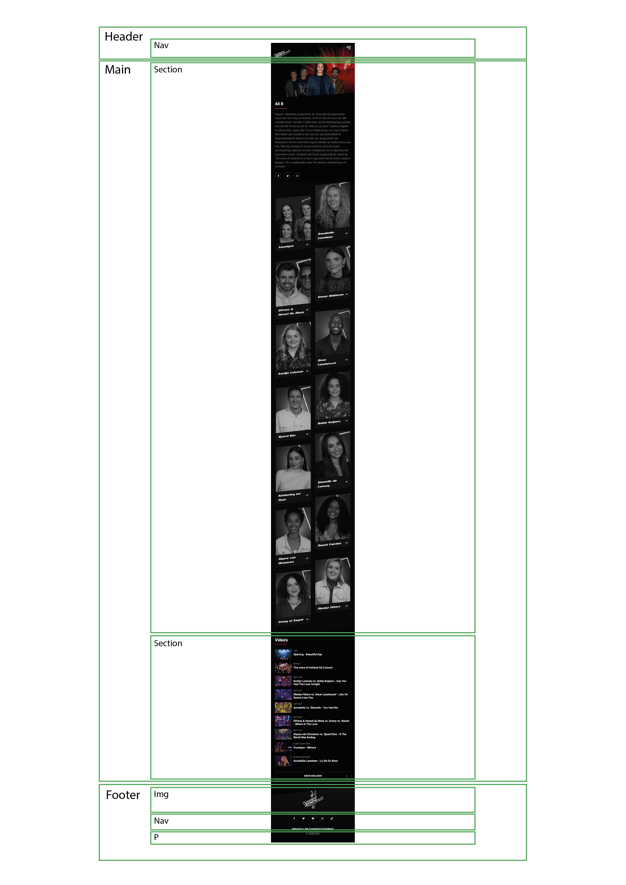

# Procesverslag
Markdown is een simpele manier om HTML te schrijven.  
Markdown cheat cheet: [Hulp bij het schrijven van Markdown](https://github.com/adam-p/markdown-here/wiki/Markdown-Cheatsheet).

Nb. De standaardstructuur en de spartaanse opmaak van de README.md zijn helemaal prima. Het gaat om de inhoud van je procesverslag. Besteedt de tijd voor pracht en praal aan je website.

Nb. Door *open* toe te voegen aan een *details* element kun je deze standaard open zetten. Fijn om dat steeds voor de relevante stuk(ken) te doen.

## Jij

uitwerken voor kick-off werkgroep

### Auteur:
Axel de Ruiter

#### Je startniveau:
blauw

#### Je focus:
responsive
 

## Je website

uitwerken voor kick-off werkgroep

### Je opdracht:
https://www.thevoiceofholland.com/

#### Screenshot(s) van de eerste pagina (small screen): 
Home pagina van The Voice of Holland 

#### Screenshot(s) van de tweede pagina (small screen):
Teams pagina van The Voice of Holland

 

## Breakdownschets (week 1)

uitwerken na afloop 2e werkgroep

### de home pagina: 

### de home pagina - close-up boven: 

### de home pagina - close-up onder: 

### dynamisch deel (bijv menu): 

### de team pagina: 

### de team pagina - close-up: 

### de aanmeldpagina: 

## Voortgang 1 (week 2)

uitwerken voor 1e voortgang

### Stand van zaken
hier dit ging goed & dit was lastig (neem ook screenshots op van delen van je website en code)

### Agenda voor meeting
samen met je groepje opstellen

| student 1      | student 2          | student 3    | student 4        |
| ---            | ---                | ---          | ---              |
| dit bespreken  | en dit             | en ik dit    | en dan ik dat    |
| en dat ook nog | dit als er tijd is | nog een punt | dit wil ik zeker |
| ...            | ...                | ...          | ...              |

### Verslag van meeting
hier na afloop snel de uitkomsten van de meeting vastleggen

- De achtergrond video speelt momenteel nog niet automatisch af op mobiel.
- De a href's invullen met "#".
- H4 veranderen in H3, dit is semantisch correct.

## Voortgang 2 (week 3)

uitwerken voor 2e voortgang

### Stand van zaken
hier dit ging goed & dit was lastig (neem ook screenshots op van delen van je website en code)

### Agenda voor meeting
samen met je groepje opstellen

| student 1      | student 2          | student 3    | student 4        |
| ---            | ---                | ---          | ---              |
| dit bespreken  | en dit             | en ik dit    | en dan ik dat    |
| en dat ook nog | dit als er tijd is | nog een punt | dit wil ik zeker |
| ...            | ...                | ...          | ...              |

### Verslag van meeting
hier na afloop snel de uitkomsten van de meeting vastleggen

- De afbeeldingen van de coaches van kleur laten verander als erover gehoverd wordt.
- Beginnen aan JavaScript.
- Eerst focussen op het geheel, daarna pas werken aan de details.
- Beginnen aan de tweede pagina.

## Toegankelijkheidstest (week 4)

uitwerken na test in 8e voortgang

### Bevindingen
Lijst met je bevindingen die in de test naar voren kwamen:

#### Laag contrast
Bij de thumbnails van een aantal video's zijn de randen slecht zichtbaar als je moeite hebt met het zien van laag contrast.

Dit zou op gelost kunnen worden door een lichte rand aan de afbeeldingen of de link toe te voegen.

#### Screenreader
De screenreader leest de h3's voor en de informatie uit de alt van de afbeelding waardoor de titels van de afbeelingen twee keer achter elkaar worden voorgelezen.

Dit kan eenvoudig worden opgelost door de informatie uit de alt weg te laten.

#### Tabben
Met tab op een klein scherm worden de elementen uit het hamburger-menu ook meegenomen waadoor je meerdere keren moet tabben om bij de volgende elementen op de zichtbare pagina te komen.

Dit kan opgelost worden door "visibility: hidden;" aan het hamburger-menu toe te voegen wanneer deze ingeklapt is.

#### Focus
Het hoofd logo en de links naar de pagina's van de coaches zijn niet zichtbaar tijdens het tabben maar werken wel.

Dit kan opgelost worden door de state ":focus" aan deze elemeten toe te voegen met een stijling.

## Voortgang 3 (week 4)

uitwerken voor 3e voortgang

### Stand van zaken
hier dit ging goed & dit was lastig (neem ook screenshots op van delen van je website en code)

### Agenda voor meeting
samen met je groepje opstellen

| student 1      | student 2          | student 3    | student 4        |
| ---            | ---                | ---          | ---              |
| dit bespreken  | en dit             | en ik dit    | en dan ik dat    |
| en dat ook nog | dit als er tijd is | nog een punt | dit wil ik zeker |
| ...            | ...                | ...          | ...              |

### Verslag van meeting
hier na afloop snel de uitkomsten van de meeting vastleggen

- Comments toevoegen aan de HTML, bijvoorbeeld het hamburger-menu dat wegvalt bij grotere schermen.
- Comments aan de selectors van de CSS toevoegen.

## Eindgesprek (week 5)

uitwerken voor eindgesprek

### Stand van zaken
hier dit ging goed & dit was lastig (neem ook screenshots op van delen van je website en code)

### Screenshot(s)

## Bronnenlijst

continu bijhouden terwijl je werkt

Nb. Wees specifiek ('css-tricks' als bron is bijv. niet specifiek genoeg).

1. Bron <a href="#!">Link</a>: https://www.codegrepper.com/code-examples/css/href+prevent+scrolling+top

2. Bron add class on scroll: https://www.youtube.com/watch?v=V9CY0F4Wc7M

3. Bron visibility:hidden;: https://webaim.org/techniques/css/invisiblecontent/

4. Bron focus stijling: https://stackoverflow.com/questions/20609485/what-is-the-default-style-of-the-blue-focus-outline-in-chrome

5. Bron content: https://www.thevoiceofholland.com/

